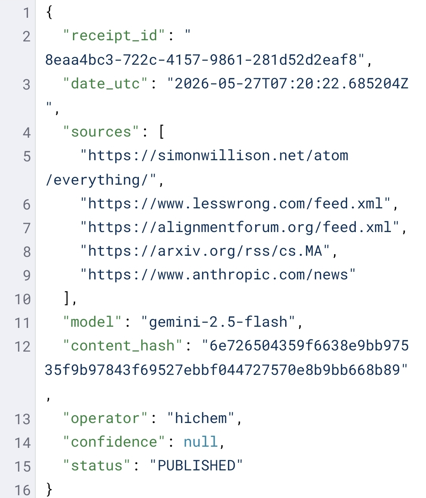

# Asso Lab

**Public observer for ACE agent governance.**

Asso Lab demonstrates one public proof surface of the ACE doctrine: bounded briefs, code-generated receipts, and traceable evidence trails.

Start with the doctrine anchor: [ACE Operating Doctrine](ACE-Operating-Doctrine.md).

**Proof in 30 seconds:**

1. Read the latest brief  
2. Open its receipt  
3. Verify: status, hash, sources, timestamp, signature  
4. See that the code records what the AI did

This is not a marketing promise. It is an inspectable trace.

---

**AI agents should not only answer.**  
**They should leave evidence.**

I built ACE because I needed a system that could reduce false readiness claims and make agent work reviewable.

**This repo proves before it claims.**

## What Asso Lab does

- Bounded weekly publications, with no weekend noise
- Auditable receipts generated by code, not by the model
- Traceable briefs, sources, hashes, timestamps, and explicit status fields

## Why it is different

Most agentic projects promise autonomy first and evidence later.

Asso Lab shows a smaller, stricter public surface: each brief comes with a receipt that can be inspected for status, hash, sources, timestamp, and signature fields.

## How it works

1. Code reads the declared sources
2. The AI proposes inside a bounded envelope
3. Code generates a receipt describing what happened
4. The receipt is stored as an audit trail
5. The result can be reviewed later

## Public and private boundary

Public artifacts demonstrate the doctrine through bounded documentation, receipts, and audit trails.

The full runtime remains private until its governance boundaries, safety envelopes, and operator controls are stable enough to expose without creating false authority claims.

This public repo does not grant runtime authority, merge authority, trading authority, publishing authority, or permission-to-act.

## Links

- [ACE Operating Doctrine](ACE-Operating-Doctrine.md) — public doctrine anchor
- [X / Twitter](https://x.com/dismerciatonton) — posts and briefs
- [Private runtime](https://github.com/monkidy/asso-execution-bridge) — full engine and complete doctrine, private for now
- [ACE-Receipt Spec](docs/ace-receipt-spec/README.md) — receipt standard in progress
- [Publications](publications/) — published briefs
- [Receipts](receipts/) — evidence trails
- [AI Ops SOP Pack](https://github.com/monkidy/ai-ops-sop-pack) — public SOPs for bounded handoffs and PR audit discipline

**ACE doctrine:** Closed by Default. Evidence First. Human Bounds. Receipts over claims. ACE governs admissibility; Asso executes only inside an explicit envelope.

## Action receipt examples

Asso Lab also includes static [action receipt examples](examples/action-receipts/) showing how ACE represents bounded agent actions: allowed, refused, or requiring human review.

These examples are not runtime proof. They show the public shape of bounded agent governance.
