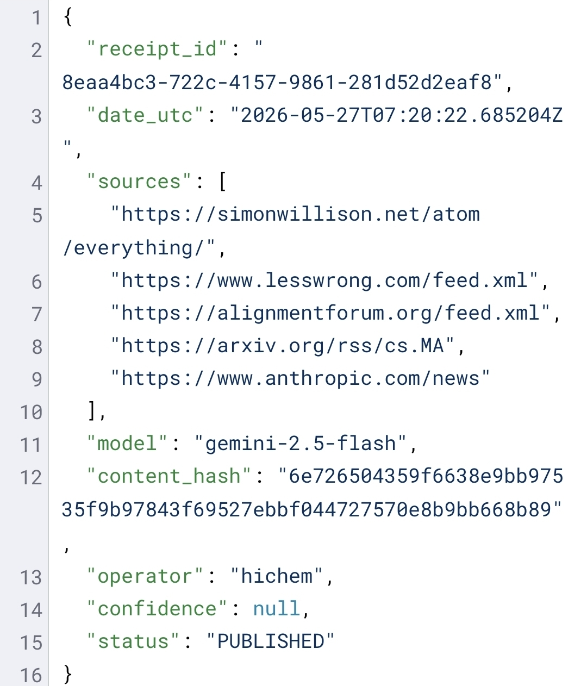

# Asso Lab

**Bounded public proof surface derived from Asso and the wider SYSTASYS work.**

Asso Lab is not Asso itself, and it is not the private SYSTASYS operating system. It is a small public surface for inspecting one part of the work: bounded briefs, receipts, evidence, refusals and reviewable agent actions.

> **Public status, 2026-10-02:** this repository is a proof surface, not a mirror of current SYSTASYS operations. Some dated artifacts preserve the older ACE name for provenance. That historical label is not the parent identity of Asso or SYSTASYS.

New here? Start with [`START_HERE.md`](START_HERE.md). It explains Asso Lab in plain English.

Prefer diagrams and tables? Open [`VISUAL_OVERVIEW.md`](VISUAL_OVERVIEW.md).

Current status: [`PUBLIC_PROOF_SURFACE_V1`](STATUS.md).

## The simple question

How do we know AI-assisted work stayed inside its limits?

Asso Lab gives a small public answer:

> Publish the brief, publish the receipt, keep the boundary visible.

## What this repo is

Asso Lab demonstrates:

- bounded briefs;
- code-generated receipts;
- traceable sources, hashes, timestamps, and status fields;
- public doctrine for fail-closed agent governance;
- examples of allowed, refused, and human-review agent actions.

The receipt/admissibility doctrine historically published under ACE remains useful here as a narrow governance layer. It is not the parent identity of Asso or SYSTASYS.

## Why this matters

AI agents should not only answer. They should leave evidence.

A claim like "done" is not enough. A reviewer should be able to inspect what happened, what did not happen, and what proof exists.

This is the principle:

> Receipts over claims.

## Proof in 30 seconds

1. Open [`publications/`](publications/) and read a public brief.
2. Open [`receipts/`](receipts/) and find its receipt.
3. Check the receipt fields: status, hash, sources, timestamp, signature.
4. Verify that the artifact is a trace, not a marketing promise.

## Who this is for

- people building AI-agent workflows;
- founders and operators using AI automation;
- compliance, legal, security, and risk reviewers;
- developers who want inspectable handoff and receipt patterns;
- non-technical visitors who need to understand what is public proof and what is not.

## Public and private boundary

Public artifacts demonstrate the doctrine through bounded documentation, receipts, examples, and audit trails.

The current private systems remain private. This repository does not expose or claim to prove current SYSTASYS runtime state, infrastructure, broker or economic state, internal operator controls, credentials, or permission-to-act.

The old social publishing pipeline that once lived in this repository is not a current public product and is not part of the current branch.

## What this repo does not prove

This repo does not prove:

- production readiness;
- formal verification;
- live runtime safety;
- private implementation safety;
- client adoption;
- revenue;
- autonomous permission-to-act.

Those claims require separate evidence.

## Main files and folders

- [`START_HERE.md`](START_HERE.md) - plain English guide.
- [`VISUAL_OVERVIEW.md`](VISUAL_OVERVIEW.md) - diagrams and one-screen tables.
- [`STATUS.md`](STATUS.md) - current public status and proof boundary.
- [`ACE-Operating-Doctrine.md`](ACE-Operating-Doctrine.md) - historical receipt/admissibility doctrine anchor.
- [`publications/`](publications/) - dated public briefs.
- [`receipts/`](receipts/) - evidence trails.
- [`examples/action-receipts/`](examples/action-receipts/) - static examples of bounded agent actions.
- [`CONTRIBUTING.md`](CONTRIBUTING.md) - contribution rules for the public surface.
- [`CHANGELOG.md`](CHANGELOG.md) - dated build log.

## Related public work

- [ACE Receipts](https://github.com/monkidy/ace-receipts): deterministic receipt and gate tool.
- [AI Ops SOP Pack](https://github.com/monkidy/ai-ops-sop-pack): published SOP pack for bounded handoffs and review.
- [ACE Agent Governance Receipt Standard](https://github.com/monkidy/ace-agent-governance-receipt-standard): early historical receipt standard kept public for provenance.

## Where this sits

- **SYSTASYS**: the wider architecture.
- **Asso**: the longitudinal cognitive interface and continuity layer.
- **Asso Lab**: this bounded public proof surface.

The deeper public map is at https://hichembenali.com/systasys and https://hichembenali.com/asso.

## Governance doctrine in one line

Closed by Default. Evidence First. Human Bounds. Receipts over claims.

Knowledge is not authority. Proposed action stays inside explicit permission.

## License

Apache-2.0.
