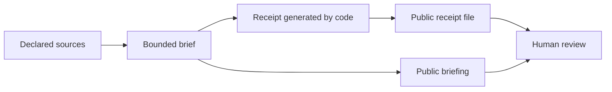
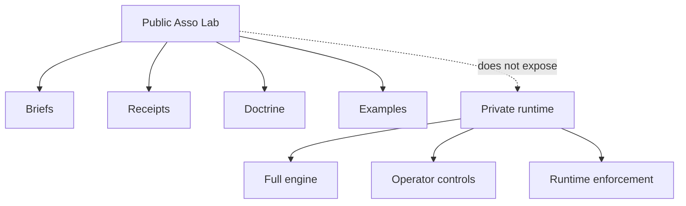

# Visual overview

This page gives a one-screen visual explanation of Asso Lab.

## One-line idea

> AI-agent work should leave evidence that a human can inspect later.

## Public proof flow



Plain meaning:

1. The system uses declared sources.
2. A bounded brief is prepared.
3. Code generates a receipt.
4. The receipt is stored publicly.
5. A human can inspect the brief and the receipt later.

## What to check in 30 seconds

| Step | Question | Where to look |
| --- | --- | --- |
| Brief | What was published? | `publications/` |
| Receipt | Is there an evidence record? | `receipts/` |
| Status | What does the receipt claim? | receipt `status` field |
| Sources | What inputs were used? | receipt `sources` field |
| Integrity | Is there a hash or signature field? | receipt hash/signature fields |
| Boundary | What does the repo not claim? | `README.md`, `STATUS.md` |

## Public vs private boundary



Plain meaning:

- This repo is public.
- It shows doctrine, examples, briefs, and receipts.
- It does not expose the private runtime.
- It does not grant permission-to-act.

## What Asso Lab is and is not

| It is | It is not |
| --- | --- |
| A public observer surface | The full private runtime |
| A receipt and briefing trail | A claim of production readiness |
| A demonstration of evidence discipline | A permission system |
| A public doctrine anchor | A trading, deployment, or send authority |

## Mental model

```text
No receipt -> no claim accepted
Public proof -> public claim only
Private runtime -> private until separately proven
Agent output -> reviewable only when evidence exists
```

## Reader map

| Reader | Start with |
| --- | --- |
| Non-technical visitor | `START_HERE.md` |
| Founder or operator | `README.md` then latest receipt |
| Developer | scripts and receipt examples |
| Compliance or legal reviewer | public/private boundary and status |
| Security reviewer | receipts, hashes, source fields, no-authority claims |
